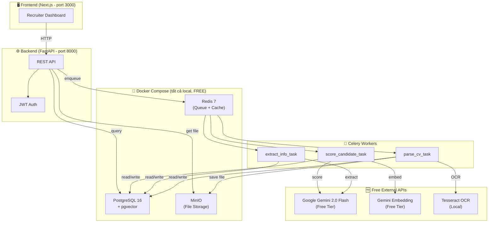
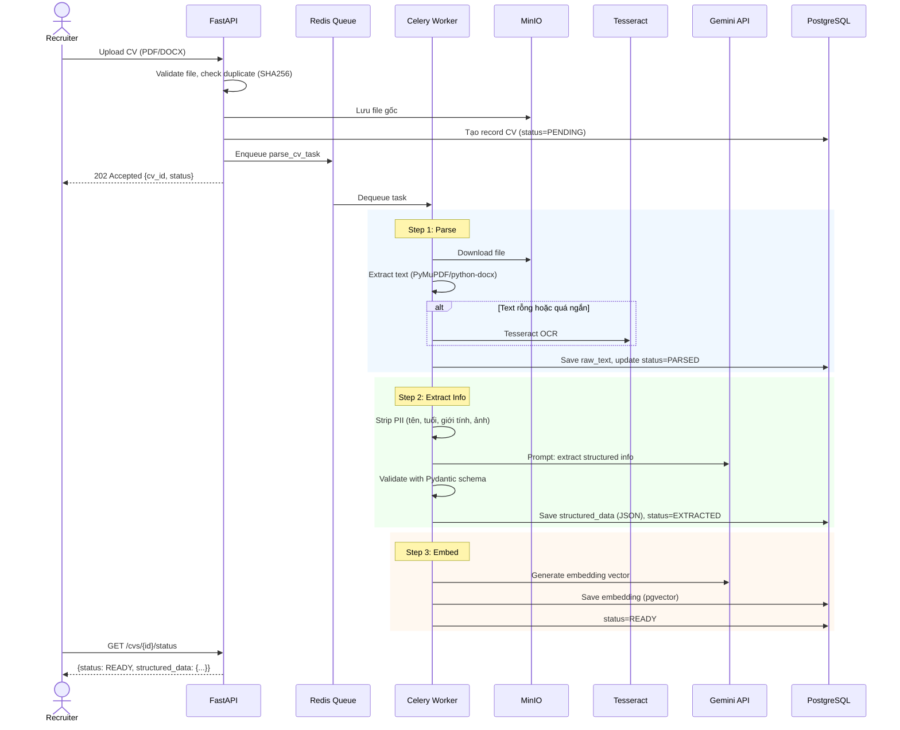
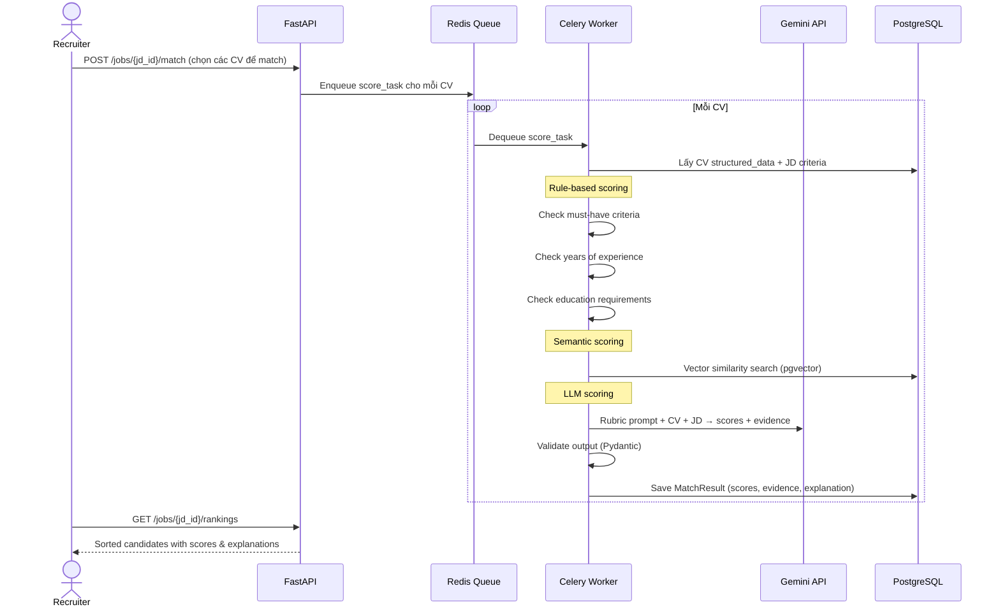
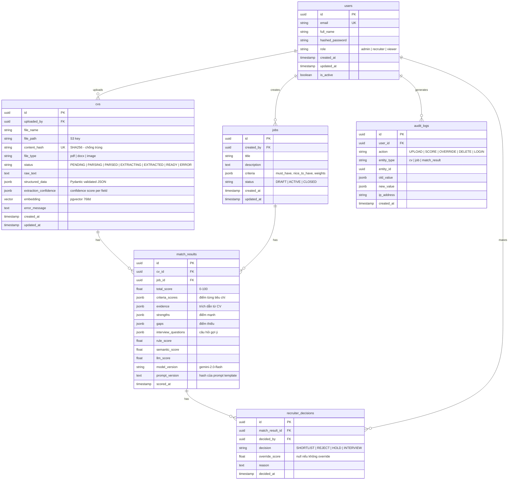

# Phase 1 — Kiến trúc tổng thể (100% FREE)

## 1. Kiến trúc hệ thống



## 2. Luồng xử lý CV (Pipeline)



### Scoring Flow (khi recruiter chọn JD để match)



## 3. Database ERD



## 4. API Contract (chính)

### Auth
| Method | Endpoint | Mô tả |
|--------|----------|--------|
| POST | `/api/v1/auth/register` | Đăng ký (chỉ admin tạo) |
| POST | `/api/v1/auth/login` | Đăng nhập → JWT token |
| GET | `/api/v1/auth/me` | Thông tin user hiện tại |

### CV Management
| Method | Endpoint | Mô tả |
|--------|----------|--------|
| POST | `/api/v1/cvs/upload` | Upload 1 CV (multipart) |
| POST | `/api/v1/cvs/upload-batch` | Upload nhiều CV (ZIP) |
| GET | `/api/v1/cvs` | List CVs (pagination, filter by status) |
| GET | `/api/v1/cvs/{id}` | Chi tiết CV + structured data |
| GET | `/api/v1/cvs/{id}/status` | Trạng thái xử lý |
| GET | `/api/v1/cvs/{id}/file` | Download file gốc |
| DELETE | `/api/v1/cvs/{id}` | Xóa CV |

### Job Description
| Method | Endpoint | Mô tả |
|--------|----------|--------|
| POST | `/api/v1/jobs` | Tạo JD mới |
| GET | `/api/v1/jobs` | List JDs |
| GET | `/api/v1/jobs/{id}` | Chi tiết JD |
| PUT | `/api/v1/jobs/{id}` | Cập nhật JD |
| DELETE | `/api/v1/jobs/{id}` | Xóa JD |

### Matching & Scoring
| Method | Endpoint | Mô tả |
|--------|----------|--------|
| POST | `/api/v1/jobs/{id}/match` | Trigger scoring cho các CV đã chọn |
| GET | `/api/v1/jobs/{id}/rankings` | Bảng xếp hạng ứng viên |
| GET | `/api/v1/match-results/{id}` | Chi tiết kết quả matching |

### Recruiter Decisions
| Method | Endpoint | Mô tả |
|--------|----------|--------|
| POST | `/api/v1/match-results/{id}/decide` | Quyết định (shortlist/reject/hold) |
| PUT | `/api/v1/match-results/{id}/override` | Override điểm + lý do |

### Audit
| Method | Endpoint | Mô tả |
|--------|----------|--------|
| GET | `/api/v1/audit-logs` | Xem audit logs (admin only) |

## 5. Cấu trúc thư mục

```
AIResumeScreeningSystem/
├── docker-compose.yml          # PostgreSQL, Redis, MinIO
├── .env.example                # Template biến môi trường
├── .gitignore
├── README.md
│
├── backend/                    # Python FastAPI
│   ├── Dockerfile
│   ├── pyproject.toml          # Dependencies (poetry/pip)
│   ├── alembic.ini             # DB migrations config
│   ├── alembic/
│   │   └── versions/           # Migration files
│   │
│   ├── app/
│   │   ├── __init__.py
│   │   ├── main.py             # FastAPI app entry
│   │   ├── config.py           # Settings (pydantic-settings)
│   │   │
│   │   ├── api/                # Route handlers
│   │   │   ├── __init__.py
│   │   │   ├── deps.py         # Dependencies (get_db, get_current_user)
│   │   │   ├── auth.py
│   │   │   ├── cvs.py
│   │   │   ├── jobs.py
│   │   │   ├── matching.py
│   │   │   └── audit.py
│   │   │
│   │   ├── models/             # SQLAlchemy ORM models
│   │   │   ├── __init__.py
│   │   │   ├── user.py
│   │   │   ├── cv.py
│   │   │   ├── job.py
│   │   │   ├── match_result.py
│   │   │   ├── decision.py
│   │   │   └── audit_log.py
│   │   │
│   │   ├── schemas/            # Pydantic request/response schemas
│   │   │   ├── __init__.py
│   │   │   ├── auth.py
│   │   │   ├── cv.py
│   │   │   ├── job.py
│   │   │   ├── matching.py
│   │   │   └── common.py
│   │   │
│   │   ├── services/           # Business logic
│   │   │   ├── __init__.py
│   │   │   ├── auth_service.py
│   │   │   ├── cv_service.py
│   │   │   ├── parsing/
│   │   │   │   ├── __init__.py
│   │   │   │   ├── pdf_parser.py
│   │   │   │   ├── docx_parser.py
│   │   │   │   └── ocr_parser.py
│   │   │   ├── extraction/
│   │   │   │   ├── __init__.py
│   │   │   │   ├── extractor.py      # LLM-based extraction
│   │   │   │   ├── pii_stripper.py   # Ẩn thông tin nhạy cảm
│   │   │   │   └── prompts.py        # Prompt templates
│   │   │   ├── matching/
│   │   │   │   ├── __init__.py
│   │   │   │   ├── rule_scorer.py    # Rule-based scoring
│   │   │   │   ├── semantic_scorer.py # Vector similarity
│   │   │   │   ├── llm_scorer.py     # LLM rubric scoring
│   │   │   │   ├── aggregator.py     # Combine scores
│   │   │   │   └── prompts.py
│   │   │   └── storage_service.py    # MinIO/S3 wrapper
│   │   │
│   │   ├── llm/                # LLM Abstraction Layer
│   │   │   ├── __init__.py
│   │   │   ├── base.py         # Abstract interface
│   │   │   ├── gemini.py       # Google Gemini implementation
│   │   │   └── factory.py      # Factory pattern
│   │   │
│   │   ├── core/               # Shared utilities
│   │   │   ├── __init__.py
│   │   │   ├── database.py     # DB session
│   │   │   ├── security.py     # JWT, password hashing
│   │   │   └── exceptions.py   # Custom exceptions
│   │   │
│   │   └── workers/            # Celery tasks
│   │       ├── __init__.py
│   │       ├── celery_app.py
│   │       ├── parse_task.py
│   │       ├── extract_task.py
│   │       └── score_task.py
│   │
│   └── tests/
│       ├── conftest.py
│       ├── test_parsing/
│       ├── test_extraction/
│       ├── test_matching/
│       └── test_api/
│
├── frontend/                   # Next.js (Phase 5)
│   ├── Dockerfile
│   ├── package.json
│   └── src/
│
└── docs/                       # Tài liệu
    ├── architecture.md
    └── api.md
```

## 6. Quyết định thiết kế chính

### 6.1 LLM Abstraction Layer
```python
# Thiết kế interface để dễ switch provider sau
class BaseLLM(ABC):
    async def generate(self, prompt: str, schema: Type[BaseModel]) -> BaseModel: ...
    async def embed(self, text: str) -> list[float]: ...

class GeminiLLM(BaseLLM):    # Free tier implementation
class OpenAILLM(BaseLLM):    # Thêm sau nếu cần
```
**Lý do:** Gemini free tier có thể hết quota → dễ switch sang provider khác.

### 6.2 Pipeline Design: Chain vs Separate Tasks
**Chọn: Separate Celery tasks** (parse → extract → score riêng biệt)
- ✅ Retry từng step độc lập
- ✅ Dễ debug (biết step nào fail)
- ✅ Parse xong có thể dùng lại, không cần re-parse khi re-score
- ❌ Phức tạp hơn chain đơn giản

### 6.3 Multi-tenant: HOÃN
**MVP: single-tenant** — thêm `tenant_id` vào schema sau.
Giảm ~25% complexity cho MVP.

### 6.4 Auth: JWT đơn giản
- Không cần SSO cho MVP free
- `bcrypt` hash password, `python-jose` JWT
- RBAC: 3 roles hardcode (admin, recruiter, viewer)

## 7. Roadmap Step-by-step

| Step | Nội dung | Thời gian ước tính |
|------|----------|-------------------|
| **Phase 2** | Docker Compose + project skeleton + config | 30 phút |
| **Phase 3a** | Database models + migrations | 30 phút |
| **Phase 3b** | Auth API (register, login, JWT) | 30 phút |
| **Phase 3c** | CV upload + storage (MinIO) | 30 phút |
| **Phase 3d** | Parsing pipeline (PDF, DOCX, OCR) | 45 phút |
| **Phase 3e** | LLM abstraction + info extraction | 45 phút |
| **Phase 4a** | JD management API | 30 phút |
| **Phase 4b** | Matching & scoring engine | 1 giờ |
| **Phase 4c** | Explainability + ranking API | 30 phút |
| **Phase 5** | Frontend (Next.js dashboard) | 2-3 giờ |
| **Phase 6** | Testing + evaluation | 1 giờ |
| **Phase 7** | Deploy + documentation | 1 giờ |

> [!NOTE]
> **Tổng ước tính: ~10-12 giờ coding** nếu đi theo hướng dẫn step-by-step.
> Mỗi step tôi sẽ viết code cụ thể, bạn copy → chạy → test → sang step tiếp.

---

> [!IMPORTANT]
> **Xác nhận trước khi bắt đầu code (Phase 2):**
> 1. Kiến trúc trên có OK không?
> 2. Bạn đã cài sẵn **Docker Desktop** và **Python 3.11+** chưa?
> 3. Bạn đã có **Google Gemini API key** chưa? (Lấy free tại https://aistudio.google.com/apikey)
> 4. Bạn muốn tôi code toàn bộ mỗi phase, hay giải thích từng đoạn để bạn hiểu và tự code?
