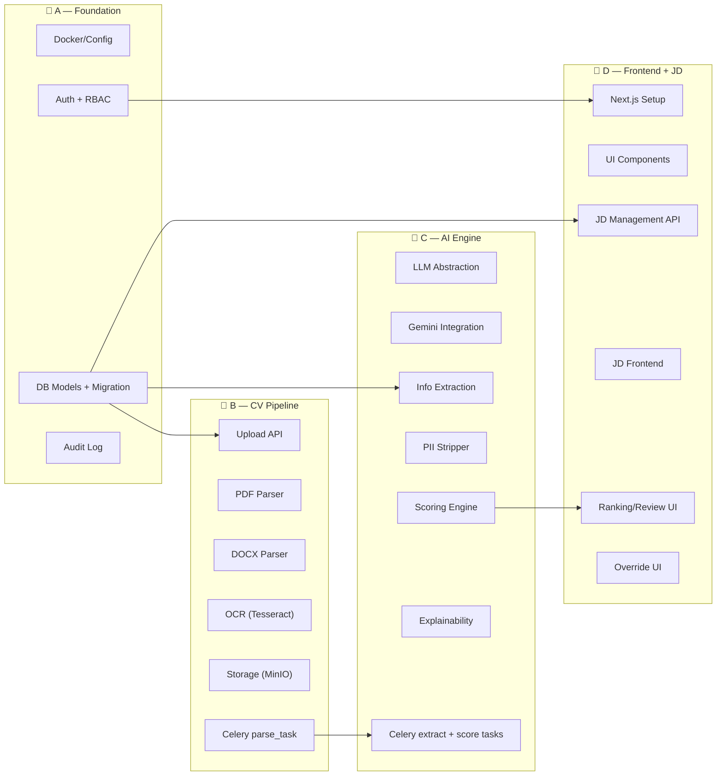
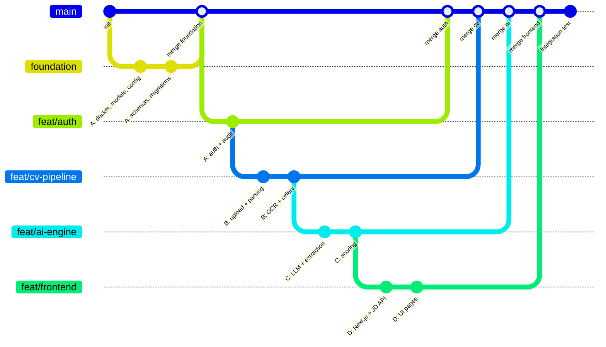

# 📋 Phân công nhóm 4 người — AI Resume Screening

## Nguyên tắc chia việc

> [!IMPORTANT]
> **Chia theo MODULE DỌC (vertical), KHÔNG chia theo LAYER (ngang).**
> - ❌ Sai: 1 người Backend, 1 người Frontend, 1 người DB... → conflict liên tục
> - ✅ Đúng: Mỗi người sở hữu 1 cụm module riêng → file khác nhau, ít đụng nhau

---

## Tổng quan phân công



---

## Chi tiết từng người

### 👤 Person A — Foundation & Auth & Audit
**Vai trò:** Tech Lead / người setup nền tảng

| Task | Files sở hữu | Ưu tiên |
|------|--------------|---------|
| Docker Compose (PG, Redis, MinIO) | `docker-compose.yml`, `.env.example` | 🔴 Ngày 1 |
| Project skeleton + pyproject.toml | `backend/pyproject.toml`, `backend/Dockerfile` | 🔴 Ngày 1 |
| Config (pydantic-settings) | `app/config.py` | 🔴 Ngày 1 |
| Database connection + session | `app/core/database.py` | 🔴 Ngày 1 |
| **Tất cả DB Models** | `app/models/*.py` | 🔴 Ngày 1 |
| Alembic migrations | `alembic/` toàn bộ | 🔴 Ngày 1 |
| Shared exceptions | `app/core/exceptions.py` | 🔴 Ngày 1 |
| **Shared Pydantic schemas** | `app/schemas/common.py` | 🔴 Ngày 1 |
| JWT + Password hashing | `app/core/security.py` | 🟡 Ngày 2 |
| Auth API (login, register) | `app/api/auth.py`, `app/schemas/auth.py` | 🟡 Ngày 2 |
| API dependencies (get_db, get_user) | `app/api/deps.py` | 🟡 Ngày 2 |
| Auth service | `app/services/auth_service.py` | 🟡 Ngày 2 |
| Audit log service + API | `app/api/audit.py`, `app/services/audit_service.py`, `app/schemas/audit.py` | 🟢 Ngày 3 |
| FastAPI main app + router | `app/main.py` | 🟡 Ngày 2 |
| Tests | `tests/test_api/test_auth.py`, `tests/conftest.py` | 🟡 Ngày 2-3 |

> [!WARNING]
> **Person A phải hoàn thành Ngày 1 TRƯỚC** để B, C, D có nền tảng để code.
> Đặc biệt: DB Models, Schemas, Docker Compose, Config.

---

### 👤 Person B — CV Pipeline (Upload → Parse → Store)
**Vai trò:** Backend — xử lý file

| Task | Files sở hữu | Ưu tiên |
|------|--------------|---------|
| Storage service (MinIO wrapper) | `app/services/storage_service.py` | 🔴 Ngày 2 |
| CV upload API (single + batch) | `app/api/cvs.py` | 🔴 Ngày 2 |
| CV schemas (request/response) | `app/schemas/cv.py` | 🔴 Ngày 2 |
| CV service (business logic) | `app/services/cv_service.py` | 🔴 Ngày 2 |
| PDF parser | `app/services/parsing/pdf_parser.py` | 🟡 Ngày 2-3 |
| DOCX parser | `app/services/parsing/docx_parser.py` | 🟡 Ngày 2-3 |
| OCR parser (Tesseract) | `app/services/parsing/ocr_parser.py` | 🟡 Ngày 3 |
| Parsing `__init__.py` (factory) | `app/services/parsing/__init__.py` | 🟡 Ngày 3 |
| Celery parse task | `app/workers/parse_task.py` | 🟡 Ngày 3 |
| Celery app config | `app/workers/celery_app.py` | 🔴 Ngày 2 |
| Deduplication (SHA256) | Trong `cv_service.py` | 🟡 Ngày 3 |
| Tests | `tests/test_parsing/`, `tests/test_api/test_cvs.py` | 🟢 Ngày 3-4 |

---

### 👤 Person C — AI Engine (LLM + Extraction + Scoring)
**Vai trò:** AI/ML Engineer

| Task | Files sở hữu | Ưu tiên |
|------|--------------|---------|
| LLM base interface | `app/llm/base.py` | 🔴 Ngày 2 |
| Gemini implementation | `app/llm/gemini.py` | 🔴 Ngày 2 |
| LLM factory | `app/llm/factory.py` | 🔴 Ngày 2 |
| PII stripper | `app/services/extraction/pii_stripper.py` | 🟡 Ngày 2-3 |
| Extraction prompts | `app/services/extraction/prompts.py` | 🟡 Ngày 2-3 |
| Info extractor (LLM → Pydantic) | `app/services/extraction/extractor.py` | 🟡 Ngày 3 |
| Extraction `__init__.py` | `app/services/extraction/__init__.py` | 🟡 Ngày 3 |
| Celery extract task | `app/workers/extract_task.py` | 🟡 Ngày 3 |
| Rule-based scorer | `app/services/matching/rule_scorer.py` | 🟢 Ngày 3-4 |
| Semantic scorer (pgvector) | `app/services/matching/semantic_scorer.py` | 🟢 Ngày 3-4 |
| LLM scorer + prompts | `app/services/matching/llm_scorer.py`, `app/services/matching/prompts.py` | 🟢 Ngày 4 |
| Score aggregator | `app/services/matching/aggregator.py` | 🟢 Ngày 4 |
| Matching schemas | `app/schemas/matching.py` | 🟡 Ngày 3 |
| Celery score task | `app/workers/score_task.py` | 🟢 Ngày 4 |
| Tests | `tests/test_extraction/`, `tests/test_matching/` | 🟢 Ngày 4-5 |

---

### 👤 Person D — Frontend + JD Management
**Vai trò:** Frontend + 1 API module

| Task | Files sở hữu | Ưu tiên |
|------|--------------|---------|
| Next.js project setup | `frontend/` toàn bộ | 🔴 Ngày 1-2 |
| UI design system (Tailwind) | `frontend/src/styles/` | 🔴 Ngày 2 |
| JD management API (backend) | `app/api/jobs.py` | 🟡 Ngày 2-3 |
| JD schemas | `app/schemas/job.py` | 🟡 Ngày 2 |
| JD service | `app/services/job_service.py` | 🟡 Ngày 2-3 |
| Matching API (trigger + rankings) | `app/api/matching.py` | 🟡 Ngày 3 |
| Login/Register page | `frontend/src/app/login/` | 🟡 Ngày 2 |
| Dashboard page | `frontend/src/app/dashboard/` | 🟡 Ngày 3 |
| CV upload page | `frontend/src/app/cvs/` | 🟡 Ngày 3 |
| JD management page | `frontend/src/app/jobs/` | 🟡 Ngày 3-4 |
| Ranking/Review page | `frontend/src/app/rankings/` | 🟢 Ngày 4-5 |
| Override + Decision UI | Trong rankings page | 🟢 Ngày 5 |
| Tests | `frontend/src/__tests__/` | 🟢 Ngày 5 |

---

## 📅 Timeline song song (Gantt)

```
Ngày 1  │ Ngày 2        │ Ngày 3         │ Ngày 4        │ Ngày 5
────────┼───────────────┼────────────────┼───────────────┼──────────
A: Docker, DB Models,   │ Auth API,      │ Audit Log     │ Review &
   Config, Schemas,     │ JWT, deps,     │ Code review   │ Fix bugs
   Migrations ██████████│ main.py ███████│ ██████████████│ █████████
                        │                │               │
B: (chờ A ngày 1)      │ Upload API,    │ OCR, Celery   │ Tests,
                        │ Storage, PDF,  │ parse task,   │ Fix bugs
                        │ DOCX ██████████│ dedup █████████│ █████████
                        │                │               │
C: (chờ A ngày 1)      │ LLM layer,     │ Extractor,    │ Scoring
                        │ Gemini, PII    │ extract task, │ engine,
                        │ ███████████████│ schemas ██████│ █████████
                        │                │               │
D: Next.js setup ██████│ UI system,     │ CV upload UI, │ Ranking
                        │ Login page,    │ JD pages,     │ Review UI
                        │ JD API ████████│ Match API ████│ █████████
```

> [!NOTE]
> **Person A làm Ngày 1 = "foundation sprint"** — cả team chờ output này.
> Ngày 2 trở đi, 4 người chạy song song trên file khác nhau.

---

## 🔀 Git Branching Strategy



### Quy tắc Git

| Quy tắc | Mô tả |
|---------|--------|
| **1 branch / người** | `feat/auth`, `feat/cv-pipeline`, `feat/ai-engine`, `feat/frontend` |
| **Merge `main` → branch hàng ngày** | Mỗi sáng pull main vào branch mình để sync |
| **PR review chéo** | A review B, B review C, C review D, D review A |
| **Không sửa file người khác** | Nếu cần → tạo issue, người sở hữu file sửa |
| **Commit message chuẩn** | `feat(cv): add PDF parser`, `fix(auth): JWT expiry` |
| **Merge `foundation` trước** | A push foundation → merge main → mọi người bắt đầu |

---

## 📁 File Ownership Matrix (AI QUAN TRỌNG NHẤT)

> [!CAUTION]
> **Mỗi file CHỈ 1 người sở hữu.** Đây là cách tránh conflict hiệu quả nhất.

```
backend/app/
├── main.py                          → A (chỉ A thêm router)
├── config.py                        → A
│
├── core/
│   ├── database.py                  → A
│   ├── security.py                  → A
│   └── exceptions.py                → A
│
├── models/                          → A (toàn bộ)
│   ├── user.py                      → A
│   ├── cv.py                        → A
│   ├── job.py                       → A
│   ├── match_result.py              → A
│   ├── decision.py                  → A
│   └── audit_log.py                 → A
│
├── schemas/
│   ├── common.py                    → A
│   ├── auth.py                      → A
│   ├── cv.py                        → B ⚠️
│   ├── job.py                       → D ⚠️
│   ├── matching.py                  → C ⚠️
│   └── audit.py                     → A
│
├── api/
│   ├── deps.py                      → A
│   ├── auth.py                      → A
│   ├── cvs.py                       → B
│   ├── jobs.py                      → D
│   ├── matching.py                  → D
│   └── audit.py                     → A
│
├── services/
│   ├── auth_service.py              → A
│   ├── cv_service.py                → B
│   ├── job_service.py               → D
│   ├── audit_service.py             → A
│   ├── storage_service.py           → B
│   ├── parsing/                     → B (toàn bộ)
│   ├── extraction/                  → C (toàn bộ)
│   └── matching/                    → C (toàn bộ)
│
├── llm/                             → C (toàn bộ)
│
└── workers/
    ├── celery_app.py                → B
    ├── parse_task.py                → B
    ├── extract_task.py              → C
    └── score_task.py                → C

frontend/                            → D (toàn bộ)
docker-compose.yml                   → A
alembic/                             → A
```

---

## 🤝 Điểm tích hợp (Integration Points)

Đây là những chỗ 2 người CẦN THỐNG NHẤT trước khi code:

| Ai ↔ Ai | Interface cần thống nhất | Khi nào sync |
|---------|-------------------------|-------------|
| **A ↔ B** | `CV` model fields, `CVStatus` enum, `cv.py` schema | Ngày 1 |
| **A ↔ C** | `MatchResult` model fields, embedding column type | Ngày 1 |
| **A ↔ D** | `Job` model fields, `job.py` schema | Ngày 1 |
| **B ↔ C** | Parse output format (`raw_text`) → Extractor input | Ngày 2 |
| **C ↔ D** | Scoring response format → Ranking UI | Ngày 3 |
| **B ↔ C** | `parse_task` kết thúc → trigger `extract_task` (Celery chain) | Ngày 3 |

### Cách giải quyết: **Contract-First Development**

**Ngày 1, cả team họp 30 phút** và thống nhất:

```python
# === Đây là "contract" mà Person A viết, mọi người review ===

# 1. CV Status enum (A viết, B dùng)
class CVStatus(str, Enum):
    PENDING = "PENDING"
    PARSING = "PARSING"
    PARSED = "PARSED"
    EXTRACTING = "EXTRACTING"
    EXTRACTED = "EXTRACTED"
    READY = "READY"
    ERROR = "ERROR"

# 2. Structured data schema (A định nghĩa, C populate, D hiển thị)
class CVStructuredData(BaseModel):
    full_name: str | None
    email: str | None
    phone: str | None
    education: list[Education]
    experience: list[Experience]
    skills: list[str]
    certifications: list[str]
    languages: list[str]

# 3. Score output schema (C viết, D hiển thị)
class MatchScoreOutput(BaseModel):
    total_score: float          # 0-100
    criteria_scores: dict       # {criterion: score}
    evidence: dict              # {criterion: [quotes]}
    strengths: list[str]
    gaps: list[str]
    interview_questions: list[str]

# 4. Parse output (B sản xuất, C tiêu thụ)
# B chỉ cần ghi raw_text vào DB, C đọc từ DB
# → Không cần interface phức tạp
```

---

## 🔄 Daily Sync Protocol

```
09:00  Standup 15 phút (online)
       - Hôm qua làm gì?
       - Hôm nay làm gì?  
       - Có blocked gì không?

17:00  Push code + tạo PR (nếu có feature hoàn chỉnh)

Bất kỳ lúc nào  Nếu cần sửa file người khác:
                 1. Tạo GitHub Issue
                 2. Tag người sở hữu file
                 3. KHÔNG tự sửa
```

---

## ⚡ Quick Reference Card (in ra cho mỗi người)

### Person A — Foundation
```
Branch: feat/foundation (ngày 1) → feat/auth (ngày 2+)
Files:  docker-compose.yml, app/models/*, app/core/*, app/api/auth.py
Test:   docker compose up → DB connect → migration → register/login
```

### Person B — CV Pipeline  
```
Branch: feat/cv-pipeline
Files:  app/api/cvs.py, app/services/parsing/*, app/services/storage_service.py
Test:   upload PDF → MinIO saved → text extracted → status=PARSED
Chờ:    Person A merge foundation (ngày 1)
```

### Person C — AI Engine
```
Branch: feat/ai-engine  
Files:  app/llm/*, app/services/extraction/*, app/services/matching/*
Test:   raw_text → Gemini → structured JSON → score output
Chờ:    Person A merge foundation (ngày 1)
```

### Person D — Frontend + JD
```
Branch: feat/frontend
Files:  frontend/*, app/api/jobs.py, app/api/matching.py
Test:   login → see dashboard → create JD → view rankings
Chờ:    Person A auth API (ngày 2) cho login flow
```
